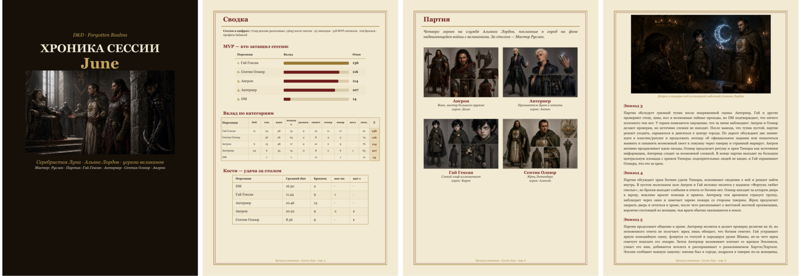

# D&D PodTrak Pipeline

**Превращает многочасовую запись настольной игры в иллюстрированную хронику сессии.**
Кладёшь в папку WAV-дорожки с рекордера, запускаешь одну команду — получаешь транскрипт
с именами персонажей, статистику бросков, MVP-рейтинг игроков и свёрстанный PDF на полсотни страниц.



<sub>Реальная сессия: обложка с артом, сводка (кто затащил, удача за столом), состав партии с портретами, хроника по эпизодам со сценами. 50 страниц.</sub>

---

## Зачем это

Сессия D&D идёт четыре-пять часов. Через месяц никто не помнит, кто договорился с
баронессой, что лежало в сундуке и почему партия должна гоблинам. Протокол руками никто
не ведёт, запись потом никто не переслушивает — четыре часа аудио никак не превратить
в пятиминутное «а что было в прошлый раз».

Пайплайн закрывает именно эту дыру. Один прогон — и у сессии появляется артефакт:
рекап на страницу, полная хроника по эпизодам, таблица бросков (у кого средний d20 16.5,
а у кого 8.5), MVP-рейтинг с доказательствами по таймкодам и красивый PDF, который
не стыдно кинуть в чат партии.

## Как это работает

```text
WAV-дорожки ──► транскрипция ──► чистка ──► AI-анализ ──► отчёты ──► PDF-хроника
               (Whisper, локально)          (Claude API      (Markdown)   (Typst, локально)
                                             или локальная LLM)
```

1. **Транскрипция.** Каждая дорожка гоняется через Whisper отдельно. На Apple Silicon —
   через MLX (GPU/Neural Engine), иначе faster-whisper на CPU.
2. **Чистка.** Дорожки синхронны сэмпл-в-сэмпл, поэтому чужие голоса, пролезшие в соседний
   микрофон, отсекаются по громкости; галлюцинации Whisper на тишине («Спасибо.»,
   «Продолжение следует...») отбрасываются фильтром; дубли между микрофонами склеиваются.
3. **AI-анализ.** Транскрипт режется на десятиминутные чанки, каждый уезжает в LLM и
   возвращается структурированным JSON: действия, броски, MVP-сигналы, пересказ.
4. **Отчёты и PDF.** Из JSON собираются markdown-отчёты и вёрстка Typst.

**Главный трюк — поканальная запись.** Каждый игрок сидит на своём микрофоне, поэтому
«кто это сказал» известно бесплатно и точно. Автоматическая диаризация одной общей дорожки
на TTRPG-звуке даёт DER 33–48% ([arXiv 2502.12714](https://arxiv.org/abs/2502.12714)) —
каждая третья реплика приписана не тому, и любая статистика по персонажам превращается в мусор.

Три свойства, ради которых всё сделано так, а не иначе:

- **Локально по умолчанию.** Аудио никогда никуда не уходит. В сеть идёт только текст
  транскрипта на AI-этапе — и то опционально: с Ollama/LM Studio весь пайплайн работает офлайн.
- **Идемпотентно.** Всё кэшируется: повторный запуск не перетранскрибирует дорожки,
  не переплачивает за AI, не пересчитывает готовое. Прервал на середине — продолжит с того же места.
- **Переносимо.** Только pip-зависимости (Whisper, `anthropic`, `typst`) + ffmpeg.
  Никаких Chromium/LaTeX/WeasyPrint.

## Кому подойдёт

**Нужно обязательно:**

- **Поканальная запись** — отдельный WAV на каждого участника. У автора это Zoom PodTrak P8,
  но подойдёт любой мультитрек-рекордер, аудиоинтерфейс или поканальная запись голосового
  чата. Одна общая дорожка не подойдёт: см. про диаризацию выше.
- **Python 3.10+ и ffmpeg.**

**Хорошо бы:**

- **Apple Silicon** — быстрый путь через MLX. На обычном CPU работает fallback
  faster-whisper, но медленнее.
- **Ключ Anthropic или OpenAI** — сессия из ~25 чанков стоит $1–1.5 на Sonnet через Batch API.
  Либо локальная LLM через Ollama/LM Studio: бесплатно, офлайн, качество разбора хуже.
  Либо вообще без ключа — ручной режим, копипаста промптов в любой чат.

**Ограничения, о которых честно:**

- Промпты анализа и все отчёты — **на русском языке**, зашиты в код. Язык транскрипции
  меняется в конфиге, промпты — правкой `dnd_pipeline.py`.
- **Времени на прогон уходит порядочно.** Сессия 4ч35м на пяти дорожках: транскрипция ~2.5 часа
  на Apple Silicon, AI батчем — от минут до часа, конец-в-конец около трёх часов.
  Это ночная задача, а не «нажал и смотришь».
- **Картинки не генерируются.** Пайплайн пишет готовые англоязычные промпты для сцен,
  а сами картинки делаешь в Midjourney (или чём угодно) и кладёшь в папку — см.
  [PDF-хроника](#pdf-хроника).
- Whisper на русском разговорном звуке с пятью орущими людьми — не идеален. Диагностика
  качества каждого прогона лежит в `reports/quality_report.md`, ручки для подстройки — в конфиге.

## Быстрый старт

```bash
brew install ffmpeg

git clone https://github.com/elektrobober/battlerattle.git
cd battlerattle
python3 -m venv .venv
source .venv/bin/activate
pip install -r requirements.txt

cp .env.example .env        # впиши ANTHROPIC_API_KEY (или пропусти — см. «Провайдеры»)
cp config.example.json /path/to/session/config.json
```

Сложи дорожки сессии в отдельную папку рядом с `config.json` и сделай **пробный прогон
на первых 10 минутах** — он занимает минуты и сразу показывает, попал ли гейт по громкости
и не съедает ли фильтр живую речь (тестовые файлы получают суффикс `_test` и не затирают
полный результат):

```bash
python3 dnd_pipeline.py run /path/to/session --limit-minutes 10
```

Посмотри `_dnd_pipeline_out/<session>/reports/quality_report_test.md` и
`clean/<session>_test_clean.txt`. Если похоже на правду — полный прогон:

```bash
python3 dnd_pipeline.py run /path/to/session
```

На выходе — транскрипт, отчёты и PDF (пока без картинок). Дальше по желанию: сгенерируй
сцены по `image_prompts.md` и пересобери PDF — см. [PDF-хроника](#pdf-хроника).

> `--config /path/to/config.json` нужен, только если конфиг лежит не в папке сессии.

## Что получается на выходе

Четыре markdown-отчёта плюс PDF. Вот куски настоящих:

**`reports/dice_stats.md`** — каждый бросок с контекстом:

```text
- `00:51:21.666` **Гай** save: natural=20 — Спасбросок телосложения при падении _high_
- `01:41:19.458` **Антернер** skill: natural=20 — Бросок на скрытность _medium_
- `01:41:22.858` **Антернер** skill: natural=0 — Бросок на скрытность, провал _medium_
```

**`reports/mvp_candidates.md`** — вклад в сессию, а не только урон:

```text
- `00:26:17.722` **Гай** +2 [idea] — Предлагает инсценировать похищение, что становится
  основой для хитроумного плана партии
- `00:50:44.422` **Ангрон** +2 [support] — Активно спасает и ловит Гая при падении
```

**`reports/session_report.md`** — пересказ по чанкам; **`reports/actions_timeline.md`** —
поминутный таймлайн действий; **`reports/quality_report.md`** — диагностика транскрипции.
И `Session_<session>_Report.pdf` со скриншота выше.

---

# Справочник

## Команды

| Команда | Что делает |
| --- | --- |
| `run <session_dir>` | Весь пайплайн: транскрипция → чистка → чанки → AI-анализ → отчёты → PDF. Если AI-этап не отработал (нет ключа, `ai.enabled: false`), останавливается на промптах — отчёты и PDF не собираются |
| `rebuild <session_dir>` | Пересобрать чистку/чанки/промпты из готового raw JSONL, без транскрипции |
| `prepare-ai <session_dir>` | Только чанки и промпты из clean JSONL |
| `ai-analyze <session_dir> [--force]` | AI-этап + отчёты: докачать недостающие чанки (готовые пропускаются по хэшу); `--force` — пересчитать всё. PDF не собирает |
| `build-report <session_dir>` | Markdown-отчёты из `manual_ai_results/` |
| `build-pdf <session_dir> [--force-synthesis]` | Собрать PDF-хронику; `--force-synthesis` — пересчитать рекап/сцены |

Общие флаги у всех команд: `--config`, `--quality-profile gentle|balanced|aggressive`,
`-v`/`--verbose` (построчный транскрипт и debug), `-q`/`--quiet` (только предупреждения).
Отдельно: `--limit-minutes N` (у `run` — транскрибировать только первые N минут каждой дорожки,
у `rebuild` — работать с `*_test_raw.jsonl`), `--backend` и `--model` (только у `run`).

## Ключи и .env

Ключи живут **только** в переменных окружения — в `config.json` и git они не попадают.

Удобный способ — `.env`:

```bash
cp .env.example .env   # рядом с dnd_pipeline.py или в папке сессии
```

Пайплайн подхватывает его сам при любой команде. Приоритет: экспортированная переменная >
`.env` папки сессии > `.env` корня репо. Файл `.env` игнорируется git'ом.

## Дорожки

Явный список в `config.json`:

```json
"tracks": [
  {"file": "dnd_2-Данжен Мастер.wav", "speaker": "Данжен Мастер", "character": "ДМ", "priority": 100},
  {"file": "dnd_2-Дима. Ангрон.wav", "speaker": "Дима", "character": "Ангрон", "priority": 50}
]
```

`priority` решает спорные дубли между микрофонами — у ДМа обычно выше.

**Авто-обнаружение:** если `tracks` не задан, пайплайн сам находит аудиофайлы в папке сессии
(расширения из `audio_extensions`, по умолчанию `.wav`). Имя файла парсится как
`Спикер. Персонаж` (`dnd_2-Дима. Ангрон.wav` → спикер «Дима», персонаж «Ангрон»); имя без
`. ` даёт спикер = персонаж. Трек спикера `dm_speaker` получает приоритет 100. `master_mix`
и записи из `exclude` пропускаются. Явный `tracks` всегда побеждает.

## Транскрипция

Два бэкенда, ключ `transcription_backend`:

| | `mlx` | `faster_whisper` |
| --- | --- | --- |
| Железо | Apple Silicon (Metal GPU / Neural Engine, fp16) | CPU |
| Модель | `mlx_model` / `model_size`, default `mlx-community/whisper-large-v3-turbo` | `model_size`, default `medium` (`device: cpu`, `compute_type: int8`) |
| VAD | Silero → `clip_timestamps` | `use_vad`, `vad_min_silence_ms` |

> Если ключ не задан вовсе, код берёт `faster_whisper` — консервативный выбор, работающий
> везде. `config.example.json` ставит `mlx`, так что на Apple Silicon достаточно скопировать его.

Смена на лету, без правки конфига:

```bash
python3 dnd_pipeline.py run /path/to/session --backend mlx --model mlx-community/whisper-large-v3
python3 dnd_pipeline.py run /path/to/session --backend faster_whisper --model medium
```

> **MLX:** `device`/`compute_type` игнорируются, beam search не реализован. Качество
> декодирования контролируется блоком `decode` (`initial_prompt`, `condition_on_previous_text`,
> `compression_ratio_threshold`, `logprob_threshold`, `no_speech_threshold`,
> `hallucination_silence_threshold`) — его выставляют профили качества.

### Препроцесс (ffmpeg, без сдвига таймкодов)

highpass → denoise → noise gate → mono 16 kHz. Гейт выставляет профиль качества,
и вручную его трогать обычно не надо — вот что ставят профили:

```json
"noise_gate_threshold_db": -52,  "noise_gate_ratio": 3    // gentle — если съедает тихие реплики
"noise_gate_threshold_db": -46,  "noise_gate_ratio": 5    // balanced — база
"noise_gate_threshold_db": -40,  "noise_gate_ratio": 8    // aggressive — если пролезают чужие голоса
```

Значения из `config.json` перекрывают профиль. Можно переопределить и на конкретной
дорожке — блок `preprocess` внутри записи `tracks`.

### Cross-track gating

Дорожки с одного рекордера синхронны сэмпл-в-сэмпл. Окно 30 мс остаётся на дорожке,
только если она лидер по RMS или в пределах `keep_margin_db` от лидера — так межканальный
bleed отсекается до транскрипции, а не после. Блок `cross_gate` в конфиге.

### Профили качества

```bash
python3 dnd_pipeline.py run /path/to/session --quality-profile balanced
```

- `gentle` — пропадают тихие реплики: мягче гейт, осторожнее дедуп;
- `balanced` — основной режим;
- `aggressive` — много дублей и чужих голосов: жёстче всё, может съесть тихую речь.

После каждого прогона — диагностика в `reports/quality_report.md`: raw/clean количество
реплик, склеенные дубли, реплики по персонажам, подозрительные сегменты по метрикам Whisper.

### Фильтр галлюцинаций

После транскрипции отбрасывается типичный мусор тишины: «Спасибо.», «Продолжение следует...»,
субтитровые фразы, повторы одного слова, сегменты с аномальным `compression_ratio` или очень
низким `rms_db`. Отброшенное не теряется — лежит в `raw/*_rejected_hallucinations.jsonl`;
настройки — блок `hallucination_filter`.

Дополнительно `merge_adjacent_same_speaker` склеивает короткие соседние куски одного
персонажа — clean.txt и промпты читаются лучше.

## AI-анализ

При `ai.enabled: true` команда `run` сама прогоняет чанки через LLM и собирает отчёты —
копировать руками ничего не нужно. Каждый чанк превращается в JSON: действия персонажей,
броски кубов, MVP-сигналы, пересказ.

Размер чанка — верхнеуровневый ключ `chunk_minutes` (по умолчанию `10`). Он же определяет,
влезет ли запрос в TPM провайдера: десять минут с party-контекстом весят ~45–55к токенов.

### Провайдеры

**`anthropic`** — облачный Claude. По умолчанию Batch API (`ai.mode: "batch"`): вдвое дешевле,
результат обычно в течение часа; сессия из ~25 чанков ≈ $1–1.5 на Sonnet. `"direct"` —
обычные запросы, за минуты. Ключ: `ANTHROPIC_API_KEY` (см. [Ключи и .env](#ключи-и-env)).

**`openai_compatible`** — любой сервер с OpenAI-совместимым `/chat/completions`: локальный
Ollama (`http://localhost:11434/v1`), LM Studio (`http://localhost:1234/v1`), OpenRouter, vLLM.
Нужен `ai.base_url`; ключ опционален. С локальной моделью пайплайн полностью офлайн.

У самого OpenAI работает и Batch API — `ai.mode: "batch"` с `base_url: "https://api.openai.com/v1"`.
Это не просто скидка 50%: батч живёт в отдельной очереди и **не тратит TPM**. На младших
тарифах это единственный рабочий режим — лимит tier-1 у `gpt-4.1` равен 30 000 токенов
в минуту, а один десятиминутный чанк с party-контекстом весит ~45–55к, то есть синхронный
запрос не влезает в окно в принципе и получает 429 сколько ни жди. Очередь батча тоже конечна
(у tier-1 ~900k enqueued-токенов), поэтому пайплайн сам режет чанки на пачки по
`ai.batch_token_budget` и шлёт их по очереди. Окно — 24 часа, обычно быстрее.

Прервал во время ожидания batch — не страшно: `batch_id` сохраняется, повторный запуск
продолжит ждать тот же batch без повторной оплаты.

Локальным серверам (Ollama, LM Studio) батча не завезли — для них `mode` по умолчанию `direct`.

```bash
python3 dnd_pipeline.py ai-analyze /path/to/session            # докачать недостающее
python3 dnd_pipeline.py ai-analyze /path/to/session --force    # пересчитать всё (напр. другой моделью)
```

### Конфиг `ai.*`

| Поле | По умолчанию | Что делает |
| --- | --- | --- |
| `enabled` | `false` | Автоматический AI-этап. `false` — ручной режим |
| `provider` | `"anthropic"` | `"anthropic"` или `"openai_compatible"` |
| `model` | `"claude-sonnet-5"` | Имя модели у провайдера |
| `mode` | `"batch"` (anthropic), `"direct"` (openai_compatible) | `"batch"` — дешевле вдвое и мимо TPM, окно до 24 часов; `"direct"` — обычные запросы, за минуты |
| `base_url` | `null` | Обязателен для `openai_compatible` |
| `api_key_env` | `null` | Имя env-переменной с ключом; default `ANTHROPIC_API_KEY` для anthropic, для `openai_compatible` не требуется |
| `max_output_tokens` | `8000` | Лимит ответа на чанк |
| `concurrency` | `2` | Параллелизм (только `direct`) |
| `structured_output` | `null` | Strict `json_schema` в запросе. `null` — авто: включается, только если `base_url` ведёт на `api.openai.com` (локальные серверы на строгой схеме падают) |
| `batch_token_budget` | `700000` | OpenAI batch: потолок enqueued-токенов на пачку; чанки сверх лимита уезжают следующей |

### Ручной режим (fallback)

Нет ключа, `enabled: false` или провайдер упал — пайплайн откатывается в ручной режим:
открой `prompts/*.md`, скорми любой LLM в чате, JSON-ответы сохрани в
`manual_ai_results/chunk_NNN_events.json`, затем:

```bash
python3 dnd_pipeline.py build-report /path/to/session
```

Формат тот же — все команды дальше работают одинаково. Копипаста из чата чинится
автоматически (typographic quotes, markdown-фенсы, юникод-нормализация). Файлы, положенные
руками, автоматика никогда не перезаписывает.

Отчёты: `reports/actions_timeline.md`, `dice_stats.md`, `mvp_candidates.md`, `session_report.md`.

## PDF-хроника

Иллюстрированный PDF-отчёт сессии: тёмная обложка с артом, оглавление, сводка (MVP-рейтинг,
кости с нат-20/нат-1), художественный рекап, зацепки и квесты, состав партии с портретами,
ключевые сцены, полная хроника и таймлайн.

Воркфлоу:

1. **`run`** в конце сам собирает PDF (пока без сцен) и считает «синтез сессии»: рекап,
   квест-хуки и готовые англоязычные промпты для картинок —
   `_dnd_pipeline_out/<session>/image_prompts.md`. (`ai-analyze` PDF не собирает — только
   `run` и `build-pdf`.)
2. Скорми промпты Midjourney (или любому генератору картинок).
3. Сохрани результат в `report_assets/` под именами `scene1.png`, `scene2.jpg`, … — номер
   соответствует сцене в `image_prompts.md`, `scene1` идёт на обложку.
4. Пересобери:

```bash
python3 dnd_pipeline.py build-pdf /path/to/session
```

Результат: `_dnd_pipeline_out/<session>/Session_<session>_Report.pdf`. Без картинок PDF тоже
собирается; синтез кэшируется (пересчёт — `--force-synthesis`).

### `party.json` — состав партии

Необязательный `report_assets/party.json` — страница «Партия» в PDF, контекст для синтеза
**и прайор для AI-анализа чанков**: список заклинаний почти однозначно указывает кастера,
даже когда разметка спикеров врёт из-за межканального bleed'а.

```json
[
  {
    "name": "Гай Гексан",
    "class_ru": "Чародей 6-го уровня, Драконья кровь",
    "player": "Карен",
    "ref": "ref.1 Гай.jpg",
    "spells": ["Гипнотический узор (Hypnotic Pattern)", "Паутина (Web)"],
    "notes_ru": "слепой подросток; единственный контроль по площади в партии",
    "appearance_en": "blind pale teenage boy, white pupil-less eyes, oversized worn coat"
  }
]
```

- `name` — обязателен;
- `class_ru`, `player` — подписи под портретом; класс идёт и в промпты;
- `ref` — файл-референс в `report_assets/`, попадает в PDF;
- `spells` — заклинания/способности: попадают в промпт каждого чанка с правилом «заклинание
  может кастовать только его владелец» — сильно улучшает атрибуцию в шумных сценах;
- `notes_ru` — особенности персонажа для промптов анализа;
- `appearance_en` — описание внешности по-английски, подмешивается в промпты сцен, чтобы
  персонажи были узнаваемы.

Правка `party.json` меняет хэш чанков → следующий `ai-analyze` пересчитает анализ с новым
контекстом (готовые результаты со старым хэшем пересчитаются; без party-файла хэши прежние,
старые кэши живы).

Одна партия на несколько сессий? Укажи общую папку в `pdf.assets_dir`.

### Конфиг `pdf.*`

| Поле | По умолчанию | Что делает |
| --- | --- | --- |
| `enabled` | `true` | Собирать ли PDF |
| `assets_dir` | `null` | Папка сцен/`party.json`; default `report_assets/` рядом с сессией |
| `campaign_title` | `"Хроники кампании"` | Подвал страниц |
| `subtitle` | `"D&D · Forgotten Realms"` | Подзаголовок обложки |

> **Переносимость.** Рендер — пакет `typst`: чистый pip-wheel, ноль системных зависимостей,
> работает одинаково на macOS/Linux/Windows. Шрифты (PT Serif, лицензия OFL) вшиты в репо —
> PDF собирается побайтово одинаково у всех. Нет пакета — `build-pdf` не падает,
> а подсказывает `pip install typst`.

## Выходные файлы

```text
_dnd_pipeline_out/<session>/
  preprocessed/                            # дорожки после ffmpeg-препроцесса и cross-gate
  raw/<session>_raw.jsonl                  # сырая транскрипция
  raw/*_rejected_hallucinations.jsonl      # отброшенный фильтром мусор
  clean/<session>_clean.jsonl              # ★ главный файл для дальнейшей работы
  clean/<session>_clean.txt|.srt
  chunks/chunk_NNN.json
  prompts/chunk_NNN_prompt.md              # промпты для ручного режима
  manual_ai_results/chunk_NNN_events.json  # результаты AI (авто или руками)
  reports/*.md                             # отчёты + quality_report.md
  session_synthesis.json                   # рекап/квесты/сцены
  image_prompts.md                         # промпты для картинок
  pdf_build/                               # staging сборки PDF
  Session_<session>_Report.pdf             # ★ финальный артефакт
  work/                                    # промежуточные файлы этапов
  cache/                                   # кэши транскрипции и AI
```

При прогоне с `--limit-minutes` все имена получают суффикс `_test`
(`<session>_test_raw.jsonl`, `quality_report_test.md`) — полный результат не затирается.

## Кэш

Каждая дорожка кэшируется отдельно: правки дедупликации, промптов или отчётов транскрипцию
не перезапускают. Смена модели, бэкенда, препроцесса или `--limit-minutes` создаёт новый кэш.
AI-результаты пропускаются по хэшу чанка; синтез — по хэшу входа. Полный сброс: удалить
`_dnd_pipeline_out/<session>/cache/`.

## Внутренняя кухня

- [`docs/pipeline_mechanics.md`](docs/pipeline_mechanics.md) — механика этапов подробно
- [`docs/asr_audit_2026-08.md`](docs/asr_audit_2026-08.md) — аудит транскрипции: откуда брались
  галлюцинации, обзор рынка ASR и диаризации на август 2026
- [`IDEAS.md`](IDEAS.md) — беклог, [`WORKLOG.md`](WORKLOG.md) — что и когда делалось
